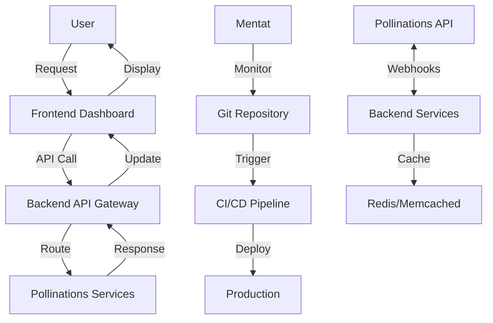

# Multi-Cloud Platform (MCP) Architecture

## Overview
This document outlines the architecture for a Multi-Cloud Platform (MCP) that integrates Pollinations.AI services with Mentat automation for a seamless AI-powered content generation experience.

## System Architecture

### 1. Core Components

#### 1.1 Frontend Dashboard
- **Technology Stack**: React.js with TypeScript
- **Key Features**:
  - User authentication and management
  - Service selection interface
  - Real-time generation monitoring
  - Result visualization and management
  - API key management

#### 1.2 Backend Services
- **Technology Stack**: FastAPI (Python)
- **Key Services**:
  - Authentication service
  - API Gateway (routes to appropriate Pollinations services)
  - Job queue management
  - Result caching
  - Rate limiting and usage tracking

#### 1.3 Pollinations Service Integration
- **Image Generation**: Integration with `image.pollinations.ai`
- **Text Generation**: Integration with `text.pollinations.ai`
- **Audio Services**: TTS and STT capabilities
- **Mentat Automation**: CI/CD and automation workflows

### 2. Mentat Integration

#### 2.1 Automated Testing
- Pre-commit hooks for code quality
- Unit and integration tests for all services
- Automated deployment testing

#### 2.2 CI/CD Pipeline
- Automated build and test workflows
- Staging and production deployment automation
- Rollback mechanisms

#### 2.3 Environment Management
- Containerized services using Docker
- Kubernetes orchestration for scalability
- Environment-specific configurations

### 3. Data Flow

## Implementation Phases

### Phase 1: Core Infrastructure
1. Set up project structure
2. Implement basic frontend dashboard
3. Create API gateway service
4. Integrate with Pollinations APIs

### Phase 2: Mentat Automation
1. Implement pre-commit hooks
2. Set up CI/CD pipelines
3. Configure automated testing
4. Implement deployment automation

### Phase 3: Advanced Features
1. User management system
2. Billing and subscription
3. Advanced analytics
4. Rate limiting and quotas

## Security Considerations

### Authentication & Authorization
- OAuth 2.0 with JWT
- Role-based access control (RBAC)
- API key management

### Data Protection
- Encryption in transit (TLS)
- Secure API key storage
- Regular security audits

### Rate Limiting
- Per-user rate limiting
- Service-level rate limiting
- Graceful degradation

## Monitoring & Logging

### Monitoring
- Service health checks
- Performance metrics
- Alerting system

### Logging
- Centralized logging
- Structured logging format
- Log rotation and retention

## Deployment Architecture

### Development
- Local development environment
- Mock services for testing
- Hot-reload for development

### Staging
- Mirrors production environment
- Integration testing
- Performance testing

### Production
- High availability setup
- Load balancing
- Auto-scaling

## Next Steps
1. Set up development environment
2. Implement core services
3. Integrate with Pollinations APIs
4. Implement Mentat automation
5. Deploy to staging for testing
6. Deploy to production
